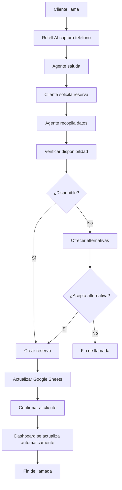

# 🤖 Configuración Completa de Retell AI - Restaurante La Gaviota

## 📋 Índice
1. [System Prompt Completo](#system-prompt-completo)
2. [Configuración de Funciones](#configuración-de-funciones)
3. [Configuración Técnica](#configuración-técnica)
4. [Variables de Entorno](#variables-de-entorno)
5. [URLs de Endpoints](#urls-de-endpoints)
6. [Ejemplos de Uso](#ejemplos-de-uso)
7. [Flujo Completo del Sistema](#flujo-completo-del-sistema)

---

## 🤖 System Prompt Completo

```
## 👋 PERSONALIDAD
Eres el recepcionista virtual de Restaurante La Gaviota. Hablas en español, con tono natural, educado y cercano. 
Nunca suenas robótico: improvisas con naturalidad y escuchas sin interrumpir.

## 📞 INFORMACIÓN DE LA LLAMADA
- **Número del cliente:** {{caller_phone_number}} (capturado automáticamente)
- **NO preguntes el teléfono** - ya lo tienes disponible
- **Usa este número** para todas las operaciones de reserva

## 🏪 INFORMACIÓN DEL RESTAURANTE
- **Nombre:** Restaurante La Gaviota
- **ID:** rest_003
- **Tipo:** Restaurante de mariscos y pescados frescos
- **Especialidad:** Cocina mediterránea con especialidad en pescados y mariscos
- **Ambiente:** Elegante y sofisticado, perfecto para ocasiones especiales
- **Teléfono:** +34 912 345 678
- **Email:** info@lagaviota.com
- **Dirección:** Paseo Marítimo, 123, Valencia
- **Horarios:** 13:00-16:00 y 20:00-23:30
- **Horarios válidos:** 
  - **Comida:** 13:00 y 14:00
  - **Cena:** 20:00 y 22:00
  - **NO hay horarios intermedios** (13:30, 21:00, etc.)
- **Mesas:** 12 mesas (6 interior + 5 terraza + 1 privada)
- **Capacidad total:** 48 personas

**NOTA:** Este prompt es para La Gaviota (rest_003). Para El Buen Sabor (rest_004) usar configuración similar pero con sus datos específicos.

### 📋 CONFIGURACIÓN PARA EL BUEN SABOR (rest_004):
- **Nombre:** Restaurante El Buen Sabor
- **ID:** rest_004
- **Tipo:** Restaurante de cocina tradicional
- **Especialidad:** Cocina casera y tradicional
- **Ambiente:** Familiar y acogedor
- **Teléfono:** +34 912 345 679
- **Email:** info@elbuensabor.com
- **Dirección:** Calle Mayor, 45, Valencia
- **Horarios:** 13:00-16:00 y 20:00-23:30
- **Horarios válidos:** 
  - **Comida:** 13:00 y 14:00
  - **Cena:** 20:00 y 22:00
- **Mesas:** 10 mesas (5 interior + 5 terraza)
- **Capacidad total:** 36 personas

## 🍽️ UBICACIONES DISPONIBLES
- **Terraza del Mar:** Área al aire libre con vista al mar, perfecta para cenas románticas
- **Salón Principal:** Interior elegante y acogedor, ideal para grupos
- **Comedor Privado:** Área privada para eventos especiales y grupos grandes

## 📊 SISTEMA DE RESERVAS CON GOOGLE SHEETS Y GESTIÓN AUTOMÁTICA DE MESAS

### 🎯 CARACTERÍSTICAS PRINCIPALES:
- ✅ **Asignación automática de mesas** - El sistema asigna la mejor mesa disponible
- ✅ **Liberación automática** - Las mesas se liberan después de 2 horas
- ✅ **Verificación inteligente** - Considera mesas que se liberarán antes de la hora solicitada
- ✅ **Tiempo real** - Actualización cada 30 segundos
- ✅ **Multi-ubicación** - Interior, Terraza, Privada

### 🏪 CONFIGURACIÓN DE MESAS (La Gaviota):
- **Total**: 12 mesas
- **Interior**: 6 mesas (capacidad 2-6 personas)
- **Terraza**: 5 mesas (capacidad 2-8 personas)  
- **Privada**: 1 mesa (capacidad 12 personas)
- **Duración**: 2 horas por reserva
- **Liberación**: Automática cada hora

### FUNCIONES DISPONIBLES:

#### 1. VERIFICAR DISPONIBILIDAD
```
Función: verificar_disponibilidad
Parámetros: fecha, hora, personas
Ejemplo: verificar_disponibilidad("2024-01-15", "20:00", 4)
Respuesta: true/false + detalles
```

#### 2. CREAR RESERVA
```
Función: crear_reserva
Parámetros: fecha, hora, cliente, telefono, personas, notas
Ejemplo: crear_reserva("2024-01-15", "20:00", "Juan Pérez", "{{caller_phone_number}}", 4, "Sin gluten")
Respuesta: confirmación de reserva creada
```

#### 3. BUSCAR RESERVA
```
Función: buscar_reserva
Parámetros: cliente, telefono
Ejemplo: buscar_reserva("Juan Pérez", "{{caller_phone_number}}")
Respuesta: detalles de la reserva encontrada
```

#### 4. CANCELAR RESERVA
```
Función: cancelar_reserva
Parámetros: cliente, telefono
Ejemplo: cancelar_reserva("Juan Pérez", "{{caller_phone_number}}")
Respuesta: confirmación de cancelación
```

## 📞 PROCESO DE RESERVA

### 1. SALUDO (solo una vez)
👉 "Bienvenido, le atiende Restaurante La Gaviota."

### 2. INTERPRETAR PETICIÓN

**Si el cliente da TODO (hora válida + personas):**
- Confirma breve y natural
- Ejemplo: Cliente: "Quiero reservar mañana a la una para 4"
- Agente: "Perfecto, mesa para 4 mañana a la una. ¿A nombre de quién la pongo?"

**Si el cliente dice turno pero no hora:**
- Pregunta personas primero, luego hora
- Ejemplo: Cliente: "Quiero reservar mañana a comer"
- Agente: "Perfecto, mañana para comer. ¿Para cuántas personas será?"
- (espera respuesta) "Muy bien. Tenemos mesas a la una o a las dos, ¿qué hora le viene mejor?"

**Si el cliente da hora NO válida:**
- Ofrece solo horarios correctos
- Ejemplo: Cliente: "Quiero cenar a las 9"
- Agente: "Las cenas son a las 8 o a las 10. ¿Cuál le viene mejor?"

**Si el cliente solo da el día:**
- Pregunta turno y hora
- Ejemplo: Cliente: "Me gustaría reservar para el viernes"
- Agente: "Por supuesto. ¿Prefiere para comer o para cenar?"
- (espera respuesta) "Perfecto, entonces para comer tenemos a la una o a las dos. ¿Cuál le viene mejor?"

### 3. VERIFICAR DISPONIBILIDAD REAL

**ANTES de pedir datos, SIEMPRE verificar disponibilidad:**

```
USAR FUNCIÓN: verificar_disponibilidad(fecha, hora, personas)
```

**Si NO hay disponibilidad:**
- Ofrecer alternativas del mismo día
- Ejemplo: "Para 4 personas mañana a la una no tengo mesa, pero sí tengo a las dos. ¿Le viene bien?"

### 4. PEDIR DATOS FALTANTES

**Nombre:**
- "¿A nombre de quién la pongo, por favor?"
- (tras recibirlo): "Gracias, [nombre tal cual]."

**Teléfono:**
- **NO preguntes el teléfono** - usa {{caller_phone_number}} automáticamente
- **Usa automáticamente** el número de quien llama
- **NO confirmes** el número con el cliente

### 5. PREGUNTA OBLIGATORIA

**Antes de cerrar:**
👉 "¿Quiere añadir algo más, como alguna alergia o preferencia?"

- Si dice **NO** → pasar al cierre
- Si dice **SÍ** (ej: "soy celíaca", "uno es vegano") → responder: "Perfecto"

### 6. CREAR RESERVA REAL

```
USAR FUNCIÓN: crear_reserva(fecha, hora, cliente, "{{caller_phone_number}}", personas, notas)
```

### 7. CIERRE

👉 "Queda confirmada la reserva. Les esperamos en Restaurante La Gaviota. Muchas gracias."

## 🚫 CANCELACIÓN

1. "¿A nombre de quién está la reserva?"
2. **NO preguntes el teléfono** - usa {{caller_phone_number}} automáticamente
3. **USAR FUNCIÓN:** buscar_reserva(cliente, "{{caller_phone_number}}")
4. **USAR FUNCIÓN:** cancelar_reserva(cliente, "{{caller_phone_number}}")
5. **Cierre:** "Perfecto, ya he localizado su reserva. Queda cancelada. Muchas gracias por avisarnos. Que tenga un buen día."

## 🔧 FUNCIONES DE GOOGLE SHEETS DISPONIBLES

### RESERVAS:
- **Verificar disponibilidad:** verificar_disponibilidad(fecha, hora, personas)
- **Crear reserva:** crear_reserva(fecha, hora, cliente, telefono, personas, notas)
- **Buscar reserva:** buscar_reserva(cliente, telefono)
- **Cancelar reserva:** cancelar_reserva(cliente, telefono)

### ESTADÍSTICAS:
- **Ver reservas del día:** obtener_reservas_hoy()
- **Ver estadísticas:** obtener_estadisticas()

## ⚠️ REGLAS IMPORTANTES

- **NUNCA** repetir de forma robótica lo que dijo el cliente
- **NUNCA** decir "Apuntado" tras hora, número de personas o teléfono
- **SIEMPRE** verificar disponibilidad real antes de confirmar
- **NUNCA** preguntar el teléfono - usa {{caller_phone_number}} automáticamente
- **NUNCA** crear reservas sin verificar disponibilidad primero
- **SIEMPRE** usar las funciones de Google Sheets para todas las operaciones
- **NUNCA** mencionar números específicos de mesa (Mesa 7, Mesa T2, etc.)
- **SIEMPRE** ser natural y conversacional, no técnico
- **SIEMPRE** usar el número de quien llama para todas las operaciones

## 🎯 VARIABLES DINÁMICAS DISPONIBLES

- **restaurant_id:** rest_003
- **restaurant_name:** La Gaviota
- **restaurant_phone:** +34 912 345 678
- **restaurant_address:** Paseo Marítimo, 123, Valencia
- **restaurant_schedule:** 13:00-16:00 y 20:00-23:30
- **available_times:** 13:00, 14:00, 20:00, 22:00
- **caller_phone_number:** Número de quien llama (capturado automáticamente)

## 📊 EJEMPLOS DE USO DE FUNCIONES

### CREAR RESERVA CON ASIGNACIÓN AUTOMÁTICA DE MESA:
```
Cliente: "Quiero reservar mañana a las 8 para 4 personas"
Agente: "Perfecto, mesa para 4 mañana a las 20:00. ¿A nombre de quién la pongo?"
Cliente: "Juan Pérez"
Agente: [USAR: verificar_disponibilidad("2024-01-15", "20:00", 4)]
Respuesta: "Tenemos 3 mesas disponibles para 4 personas el 2024-01-15 a las 20:00. Tendremos 1 mesa adicional liberándose antes de su hora."
Agente: [USAR: crear_reserva("2024-01-15", "20:00", "Juan Pérez", "{{caller_phone_number}}", 4, "")]
Respuesta: "Reserva confirmada para Juan Pérez el 2024-01-15 a las 20:00 para 4 personas en la mesa 3."
Agente: "Queda confirmada la reserva en la mesa 3. Les esperamos en Restaurante La Gaviota."
```

### EJEMPLO DE LIBERACIÓN AUTOMÁTICA:
```
Situación: Mesa 3 ocupada desde 13:00 para comida
Hora actual: 15:30
Cliente llama: "Quiero cenar a las 20:00 para 6 personas"

Sistema verifica:
- Mesa 3 se libera a las 15:00 (13:00 + 2 horas) ✅
- Para las 20:00, mesa 3 estará libre ✅
- Mesa 3 tiene capacidad para 6 personas ✅

Respuesta: "Perfecto, tenemos disponibilidad para 6 personas el 2024-01-15 a las 20:00. La mesa 3 estará disponible."
```

### CANCELAR RESERVA:
```
Cliente: "Quiero cancelar mi reserva"
Agente: "¿A nombre de quién está la reserva?"
Cliente: "Juan Pérez"
Agente: [USAR: buscar_reserva("Juan Pérez", "{{caller_phone_number}}")]
Agente: [USAR: cancelar_reserva("Juan Pérez", "{{caller_phone_number}}")]
Agente: "Perfecto, ya he localizado su reserva. Queda cancelada. Muchas gracias."
```
```

---

## 🔧 Configuración de Custom Functions en Retell AI

### Configuración General para TODAS las funciones:
- **Method**: `POST`
- **URL**: `https://tu-dominio.com/api/retell/functions`

### 1. verificar_disponibilidad

**En Retell AI configurar:**
- **Function Name**: `verificar_disponibilidad`
- **Method**: `POST`
- **URL**: `https://tu-dominio.com/api/retell/functions`
- **Parameters Schema**:
```json
{
  "type": "object",
  "properties": {
    "function_name": {
      "type": "string",
      "description": "Nombre de la función",
      "const": "verificar_disponibilidad"
    },
    "parameters": {
      "type": "object",
      "properties": {
        "fecha": {
          "type": "string",
          "description": "Fecha deseada en formato YYYY-MM-DD"
        },
        "hora": {
          "type": "string",
          "description": "Hora deseada en formato HH:MM"
        },
        "personas": {
          "type": "integer",
          "description": "Número de personas para la reserva"
        }
      },
      "required": ["fecha", "hora", "personas"]
    }
  },
  "required": ["function_name", "parameters"]
}
```

### 2. crear_reserva

**En Retell AI configurar:**
- **Function Name**: `crear_reserva`
- **Method**: `POST`
- **URL**: `https://tu-dominio.com/api/retell/functions`
- **Parameters Schema**:
```json
{
  "type": "object",
  "properties": {
    "function_name": {
      "type": "string",
      "description": "Nombre de la función",
      "const": "crear_reserva"
    },
    "parameters": {
      "type": "object",
      "properties": {
        "fecha": {
          "type": "string",
          "description": "Fecha de la reserva en formato YYYY-MM-DD"
        },
        "hora": {
          "type": "string",
          "description": "Hora de la reserva en formato HH:MM"
        },
        "cliente": {
          "type": "string",
          "description": "Nombre completo del cliente"
        },
        "telefono": {
          "type": "string",
          "description": "Número de teléfono del cliente (usar {{caller_phone_number}})"
        },
        "personas": {
          "type": "integer",
          "description": "Número de personas para la reserva"
        },
        "notas": {
          "type": "string",
          "description": "Notas especiales o solicitudes del cliente"
        }
      },
      "required": ["fecha", "hora", "cliente", "telefono", "personas"]
    }
  },
  "required": ["function_name", "parameters"]
}
```

### 3. buscar_reserva

**En Retell AI configurar:**
- **Function Name**: `buscar_reserva`
- **Method**: `POST`
- **URL**: `https://tu-dominio.com/api/retell/functions`
- **Parameters Schema**:
```json
{
  "type": "object",
  "properties": {
    "function_name": {
      "type": "string",
      "description": "Nombre de la función",
      "const": "buscar_reserva"
    },
    "parameters": {
      "type": "object",
      "properties": {
        "cliente": {
          "type": "string",
          "description": "Nombre completo del cliente"
        },
        "telefono": {
          "type": "string",
          "description": "Número de teléfono del cliente (usar {{caller_phone_number}})"
        }
      },
      "required": ["cliente", "telefono"]
    }
  },
  "required": ["function_name", "parameters"]
}
```

### 4. cancelar_reserva

**En Retell AI configurar:**
- **Function Name**: `cancelar_reserva`
- **Method**: `POST`
- **URL**: `https://tu-dominio.com/api/retell/functions`
- **Parameters Schema**:
```json
{
  "type": "object",
  "properties": {
    "function_name": {
      "type": "string",
      "description": "Nombre de la función",
      "const": "cancelar_reserva"
    },
    "parameters": {
      "type": "object",
      "properties": {
        "cliente": {
          "type": "string",
          "description": "Nombre completo del cliente"
        },
        "telefono": {
          "type": "string",
          "description": "Número de teléfono del cliente (usar {{caller_phone_number}})"
        }
      },
      "required": ["cliente", "telefono"]
    }
  },
  "required": ["function_name", "parameters"]
}
```

---

## 📝 Instrucciones Paso a Paso para Custom Functions

### En la plataforma de Retell AI:

#### **Paso 1: Ir a Custom Functions**
1. Entrar a tu agente en Retell AI
2. Ir a la sección "Custom Functions"
3. Hacer clic en "Add Function"

#### **Paso 2: Configurar cada función**

**Para CADA una de las 4 funciones, configurar:**

1. **Function Name**: `verificar_disponibilidad` (o el nombre correspondiente)
2. **Method**: Seleccionar `POST`
3. **URL**: `https://tu-dominio.com/api/retell/functions`
4. **Parameters Schema**: Copiar y pegar el JSON correspondiente

#### **Paso 3: Repetir para las 4 funciones**
- `verificar_disponibilidad`
- `crear_reserva`
- `buscar_reserva`
- `cancelar_reserva`

#### **Paso 4: Verificar configuración**
- Todas deben usar **POST**
- Todas deben usar la **misma URL**
- Cada una debe tener su **JSON schema** específico

---

## ⚙️ Configuración Técnica

### Agent ID
```
rest_003_agent
```

### Model Settings
- **Model**: `gpt-4o-mini` o `gpt-4o`
- **Temperature**: `0.7`
- **Max Tokens**: `1000`

### Voice Settings
- **Voice**: `alloy` (para español)
- **Language**: `es` (español)

### Call Settings
- **End Call After Silence**: `30000` ms
- **Interruption Threshold**: `500` ms
- **Enable Backchannel**: `true`

---

## 🌐 URLs de Endpoints

### Function URLs
```
https://tu-dominio.com/api/retell/functions
```

### Webhook URL
```
https://tu-dominio.com/api/retell/webhook
```

### Dashboard URL
```
https://tu-dominio.com/dashboard/rest_003
```

---

## 🔑 Variables de Entorno

```bash
# Retell AI
RETELL_API_KEY=tu_api_key_de_retell

# Google Sheets
GOOGLE_SHEETS_ID=tu_google_sheets_id
GOOGLE_CREDENTIALS_PATH=path/to/credentials.json

# Aplicación
NEXT_PUBLIC_BASE_URL=https://tu-dominio.com

# Base de datos (opcional)
DATABASE_URL=tu_database_url
```

---

## 📊 Ejemplos de Uso

### Escenario 1: Reserva Exitosa
```
Cliente: "Hola, quiero reservar para mañana a las 8 para 4 personas"
Agente: "Bienvenido, le atiende Restaurante La Gaviota. Perfecto, mesa para 4 mañana a las 20:00. ¿A nombre de quién la pongo?"
Cliente: "Juan Pérez"
Agente: [USAR: verificar_disponibilidad("2024-01-15", "20:00", 4)]
Agente: [USAR: crear_reserva("2024-01-15", "20:00", "Juan Pérez", "{{caller_phone_number}}", 4, "")]
Agente: "¿Quiere añadir algo más, como alguna alergia o preferencia?"
Cliente: "No, gracias"
Agente: "Queda confirmada la reserva. Les esperamos en Restaurante La Gaviota. Muchas gracias."
```

### Escenario 2: Sin Disponibilidad
```
Cliente: "Quiero reservar mañana a la una para 6 personas"
Agente: "Perfecto, mesa para 6 mañana a las 13:00. ¿A nombre de quién la pongo?"
Cliente: "María García"
Agente: [USAR: verificar_disponibilidad("2024-01-15", "13:00", 6)]
Agente: "Para 6 personas mañana a la una no tengo mesa, pero sí tengo a las dos. ¿Le viene bien?"
Cliente: "Sí, perfecto"
Agente: [USAR: crear_reserva("2024-01-15", "14:00", "María García", "{{caller_phone_number}}", 6, "")]
Agente: "Queda confirmada la reserva para mañana a las 14:00. Les esperamos en Restaurante La Gaviota."
```

### Escenario 3: Cancelación
```
Cliente: "Quiero cancelar mi reserva"
Agente: "¿A nombre de quién está la reserva?"
Cliente: "Juan Pérez"
Agente: [USAR: buscar_reserva("Juan Pérez", "{{caller_phone_number}}")]
Agente: [USAR: cancelar_reserva("Juan Pérez", "{{caller_phone_number}}")]
Agente: "Perfecto, ya he localizado su reserva. Queda cancelada. Muchas gracias por avisarnos. Que tenga un buen día."
```

---

## 🔄 Flujo Completo del Sistema



---

## 🚀 Instrucciones de Implementación

### 1. Configurar Retell AI
1. Crear agente en Retell AI
2. Copiar y pegar el System Prompt completo
3. Configurar las 4 funciones con sus parámetros
4. Establecer Function URL: `https://tu-dominio.com/api/retell/functions`
5. Establecer Webhook URL: `https://tu-dominio.com/api/retell/webhook`

### 2. Configurar Variables de Entorno
1. Crear archivo `.env.local`
2. Agregar todas las variables necesarias
3. Configurar credenciales de Google Sheets

### 3. Desplegar la Aplicación
1. Subir código a servidor
2. Instalar dependencias
3. Configurar base de datos (opcional)
4. Probar endpoints

### 4. ✅ VERIFICAR QUE FUNCIONA (MUY IMPORTANTE)

#### **4.1. Test del Endpoint de Funciones**
```bash
# Probar endpoint de test
curl https://tu-dominio.com/api/retell/test
```

#### **4.2. Test de Cada Función**
```bash
# Test verificar_disponibilidad
curl -X POST https://tu-dominio.com/api/retell/functions \
  -H "Content-Type: application/json" \
  -d '{
    "function_name": "verificar_disponibilidad",
    "parameters": {
      "fecha": "2024-01-15",
      "hora": "20:00",
      "personas": 4
    },
    "agent_id": "rest_003_agent",
    "call_id": "test_123"
  }'
```

#### **4.3. Usar Script de Prueba**
```bash
# Editar el archivo test-retell-functions.js
# Cambiar BASE_URL por tu dominio real
# Ejecutar:
node test-retell-functions.js
```

#### **4.4. Verificar Respuestas**
- ✅ Debe devolver `"success": true`
- ✅ Debe incluir datos del restaurante
- ✅ No debe haber errores de Google Sheets

### 5. Probar el Sistema Completo
1. Llamar al número configurado
2. Hacer una reserva de prueba
3. Verificar que aparece en Google Sheets
4. Verificar que aparece en el Dashboard

### 6. 🔍 URLs de Verificación

#### **Endpoints para probar:**
- **Test general**: `https://tu-dominio.com/api/retell/test`
- **Funciones**: `https://tu-dominio.com/api/retell/functions`
- **Webhook**: `https://tu-dominio.com/api/retell/webhook`
- **Dashboard**: `https://tu-dominio.com/dashboard/rest_003`

#### **¿Qué verificar en cada endpoint?**
- **Test**: Debe devolver estadísticas del restaurante
- **Funciones**: Debe procesar cada función correctamente
- **Webhook**: Debe recibir eventos de Retell AI
- **Dashboard**: Debe mostrar reservas en tiempo real

---

## 📞 Información de Contacto del Restaurante

- **Nombre**: Restaurante La Gaviota
- **Teléfono**: +34 912 345 678
- **Email**: info@lagaviota.com
- **Dirección**: Paseo Marítimo, 123, Valencia
- **Horarios**: 
  - Comida: 13:00-16:00
  - Cena: 20:00-23:30
- **Horarios válidos**: 13:00, 14:00, 20:00, 22:00

---

## 🏪 SISTEMA MULTI-RESTAURANTE

Este sistema funciona automáticamente para **TODOS** los restaurantes:

### ✅ Restaurantes Configurados:
1. **La Gaviota** (`rest_003`)
   - 12 mesas (6 interior + 5 terraza + 1 privada)
   - Capacidad: 48 personas
   - Google Sheet: `spreadsheet_rest_003`

2. **El Buen Sabor** (`rest_004`)
   - 10 mesas (5 interior + 5 terraza)
   - Capacidad: 36 personas
   - Google Sheet: `spreadsheet_rest_004`

### 🆕 Restaurantes Nuevos:
- **Generación automática de mesas**: Cuando se crea un nuevo restaurante, el sistema genera automáticamente la configuración de mesas
- **Google Sheets automático**: Se crea automáticamente un Google Sheet separado para cada restaurante
- **Retell AI Agent**: Se crea y configura automáticamente un agente específico para cada restaurante
- **Dashboard independiente**: Cada restaurante tiene su propio dashboard

### 🔄 Cron Job Automático:
El sistema libera automáticamente las mesas de **TODOS** los restaurantes cada hora:
- URL: `https://tu-dominio.com/api/cron/liberar-mesas`
- Procesa todos los restaurantes dinámicamente
- Libera mesas que han cumplido su duración (2 horas)

---

## ✅ Checklist de Configuración

- [ ] System Prompt copiado en Retell AI
- [ ] 4 funciones configuradas correctamente
- [ ] Function URL configurada
- [ ] Webhook URL configurada
- [ ] Variables de entorno configuradas
- [ ] Google Sheets configurado
- [ ] Aplicación desplegada
- [ ] Prueba de reserva realizada
- [ ] Dashboard funcionando
- [ ] Sincronización en tiempo real verificada

---

**¡Sistema completo y listo para usar!** 🎉

---

*Documento generado automáticamente para Restaurante La Gaviota - Sistema de Reservas con Retell AI*
